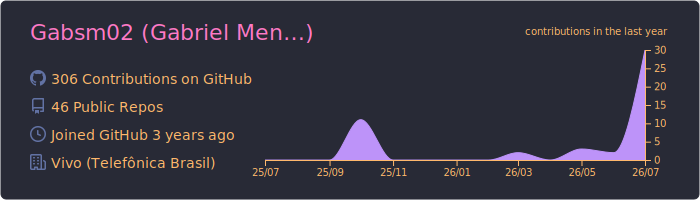
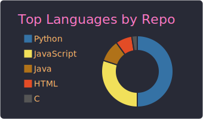

<h1 align="center">
    
</h1>
<h2 align="center">Engenheiro de Software focado em automação, dados e IA aplicada</h2>
 

Estagiário de Engenharia na <b>Vivo (Telefônica Brasil)</b>, onde construo pipelines em Python que eliminam processos manuais em operações de rede móvel na Bahia — substituindo horas de trabalho repetitivo por automações que rodam sozinhas, cruzam bases de dados e entregam dashboards prontos para decisão.

📍 Salvador, Bahia &nbsp;|&nbsp; 🎓 Engenharia de Software — UNIFACS &nbsp;|&nbsp; 🖥️ Núcleo de TI — Praxis Empresa Júnior

 

## 🚀 Projetos em destaque
 
### 📡 Automação de Consolidação de Dados de ERB (Rádio Base)
Pipeline em Python que baixa, extrai e consolida indicadores de estações rádio base e status de backlog de rede móvel na Bahia, cruzando com base de referência e aplicando regras de negócio automaticamente.
**Impacto:** reduz um processo manual de horas para minutos, eliminando erro humano no cruzamento de planilhas.
`Python` `Pandas` `Automação de dados`
**[→ Ver repositório](https://github.com/Gabsm02/automacao_setores_celldowntime)**
 
### 📊 Automação e Dashboard de Infraestrutura O&M
Pipeline em Python que processa dados de infraestrutura de rede móvel (Bahia), cruza municípios com DDDs, filtra por contratada e mantém histórico versionado em banco MariaDB. Dashboard interativo em Streamlit com filtros, gráficos e busca por site.
**Impacto:** acompanhamento contínuo da evolução dos indicadores, antes feito manualmente em planilhas isoladas.
`Python` `Streamlit` `MariaDB` `Dashboards`
**[→ Ver repositório](https://github.com/Gabsm02/automacao_coinfra)**
 
### 🤖 BotAcessos — Bot de Consulta de Credenciais via Telegram
Bot que permite a técnicos de campo consultar credenciais de acesso (portão/gabinete) de sites de rede diretamente pelo Telegram, com backend em Google Sheets. Migrado de Python para Node.js.
`Node.js` `Telegraf` `Google Sheets API`
 
 

## 🛠️ Stack técnica
 
**Linguagens & Backend**

    
    
    
    
    

**Dados & Automação**

    
    

Pandas &nbsp;•&nbsp; OpenPyXL &nbsp;•&nbsp; Requests / Sessions autenticadas &nbsp;•&nbsp; Microsoft Graph API &nbsp;•&nbsp; Power Automate &nbsp;•&nbsp; MariaDB/MySQL &nbsp;•&nbsp; Streamlit &nbsp;•&nbsp; OpenAI API
 
**Frontend**

    
    
    
    

 

## 📈 GitHub Stats
 

  
  

 
 

## 📫 Contato
 

  
  

